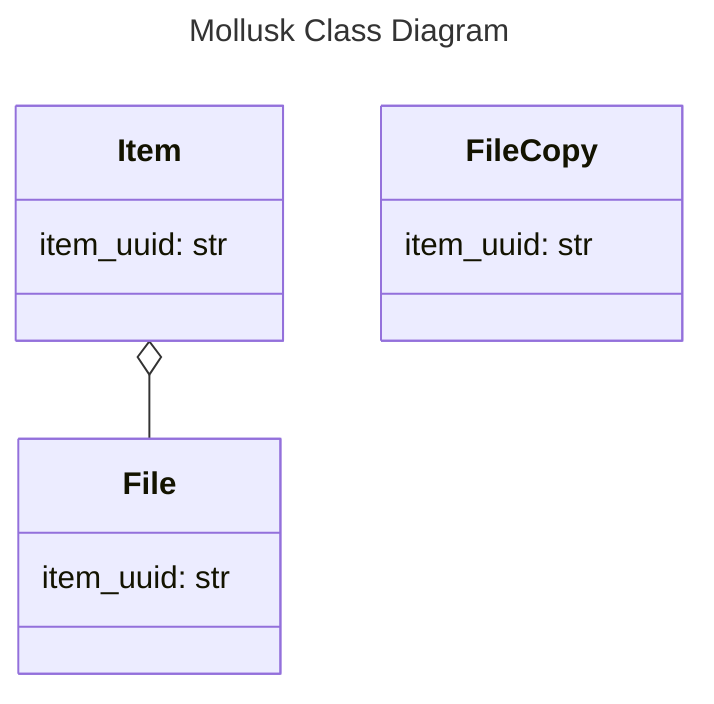

```mermaid
---
title: Mollusk Class Diagram
---

%%	<|--	Inheritance
%%	*--	Composition
%%	o--	Aggregation
%%	-->	Association
%%	--	Link (Solid)
%%	..>	Dependency
%%	..|>	Realization
%%	..	Link (Dashed)

classDiagram
    
    class Item {
        item_uuid: str
    }
    class File {
        item_uuid: str
    }
    class FileCopy {
        item_uuid: str
    }
    
    Item o-- File
    
    
```
